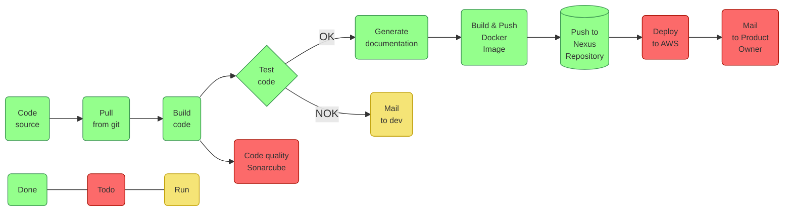

# Mise en place d'une usine logiciel avec CI/CD


## YouCoffee Application

Il s'agit des prémices d'une application permettant de composer ses cafés. L'application permettra  à un utilisateur de créer un compte et de s'y connecter pour gérer ses commandes.  L'application permettra de composer des cafés. Un café est représenté par un nom, prix, et un ensemble de grain de d'origine et prix. 

## Lien git

```bash
git clone https://github.com/DaviJam/CoffeeYou.git
```


## 1. Architecture de l'application

```
com.appiciel.youcoffee
	| 
	+- domain
	|	  |
	|	  +- Coffee # classe désignant un café
	|	  +- Grain 	# classe désignant un grain
	|	  +- User 	# classe désignant un utilisateur
    |
    +- dto
    |	|
    |	+- CoffeeDTO # classe utilisée pour le transfert 
    |	|			   de données désignant un café
    |   +- GrainDTO  # classe utilisée pour le transfert 
    |    			   de données désignant un grain
    |
    +- enumeration
    |		|
    |		+- Role # Enumération désignant les rôles 
    |				  que peut avoir l'utilisateur
    |
    +- mapper
    |	  |
    |	  +- CustomMapper # classe permettant de transférer 
    |	  					les données des objets de transfert 
    |	  					vers de objets métiers
    |
    +- repository
    |	  |
    |	  + CofferRepository # interface permettant d'utiliser les
    |     | 				   fonctionnalités de l'API de persistence 
    |     |                    JAVA (CRUD) pour les objets de type Coffee
    |     +- GrainRepository # interface permettant d'utiliser les
    |      					   fonctionnalités de l'API de persistence 
    |                          JAVA (CRUD) pour les objets de type Grain
    |
    +- service
    	  |
    	  +- CoffeeService # classe permettant d'effectuer des traitements 
    	  |					 sur les objets de type Coffee.
    	  +-GrainService # classe permettant d'effectuer des traitements 
    	  					 sur les objets de type Grain.
    	  
```


## 2. Architecture de l'usine logicielle

#### Etat actuel de l'usine




## 3. Métriques des tests


## 4. Mise en place de l'usine

### a) Créer un serveur Jenkins Maven Terraform avec Docker 

##### 1- Créer un réseau pont sur docker

```bash
docker network create --subnet 178.12.0.0/16 jenkins 
```


##### 2- Lancer le serveur docker host

```bash
docker run \
  --name jenkins-docker \
  --rm \
  --detach \
  --privileged \
  --network jenkins \
  --network-alias docker \
  --env DOCKER_TLS_CERTDIR=/certs \
  --volume jenkins-docker-certs:/certs/client \
  --volume jenkins-data:/var/jenkins_home \
  --publish 2376:2376 \
  docker:dind \
  --storage-driver overlay2
```


##### 3- Créer un dockerfile 

```dockerfile
FROM jenkins/jenkins:jdk11

#need root user
USER root

# Install tools and software
RUN apt-get update && apt-get install -y lsb-release
RUN curl -fsSLo /usr/share/keyrings/docker-archive-keyring.asc https://download.docker.com/linux/debian/gpg
RUN echo "deb [arch=$(dpkg --print-architecture) signed-by=/usr/share/keyrings/docker-archive-keyring.asc] https://download.docker.com/linux/debian $(lsb_release -cs) stable" > /etc/apt/sources.list.d/docker.list
RUN apt-get update && apt-get install -y software-properties-common unzip wget maven docker-ce-cli

# Install Terraform
ARG TERRAFORM_VERSION=1.2.2
RUN wget --progress=dot:mega https://releases.hashicorp.com/terraform/${TERRAFORM_VERSION}/terraform_${TERRAFORM_VERSION}_linux_amd64.zip

RUN \
        unzip terraform_${TERRAFORM_VERSION}_linux_amd64.zip && \
        mv terraform /usr/local/bin/ && \
        chmod +x /usr/local/bin/terraform && \
        terraform --version

#jenkins user
USER jenkins

RUN jenkins-plugin-cli --plugins "blueocean:1.25.3 docker-workflow:1.28"
```


##### 4- Créer l'image

```bash
docker build --tag jenkins_mvn_docker_terraform:latest .
```


##### 5- Lancer le serveur jenkins...

```bash
docker run \
  --name jenkins-blueocean \
  --restart=on-failure \
  --detach \
  --network jenkins \
  --env DOCKER_HOST=tcp://docker:2376 \
  --env DOCKER_CERT_PATH=/certs/client \
  --env DOCKER_TLS_VERIFY=1 \
  --publish 8099:8080 \
  --publish 50000:50000 \
  --volume jenkins-data:/var/jenkins_home \
  --volume jenkins-docker-certs:/certs/client:ro \
  jenkins_mvn_docker_terraform:latest
```


### b) Nexus configuration

##### 1- Configure pom.xml

```xml
<distributionManagement>
    <snapshotRepository>
        <id>nexus-snapshots</id>
        <url>http://178.12.0.10:8081/nexus/content/repositories/snapshots</url>
    </snapshotRepository>
</distributionManagement>
<plugin>
    <groupId>org.sonatype.plugins</groupId>
    <artifactId>nexus-staging-maven-plugin</artifactId>
    <version>1.5.1</version>
    <extensions>true</extensions>
    <configuration>
        <serverId>nexus</serverId>
        <nexusUrl>http://178.12.0.10:8081/nexus/</nexusUrl>
        <skipStaging>true</skipStaging>
    </configuration>
</plugin>
```


##### 2- Créer un fichier avec les accès au serveur nexus 

:warning:**INTERDIT EN PRODUCTION**:warning:

```
<settings xmlns="http://maven.apache.org/SETTINGS/1.0.0"
          xmlns:xsi="http://www.w3.org/2001/XMLSchema-instance"
          xsi:schemaLocation="http://maven.apache.org/SETTINGS/1.0.0 http://maven.apache.org/xsd/settings-1.0.0.xsd">

    <pluginGroups>
    </pluginGroups>

    <proxies>
    </proxies>

    <!-- servers
     | This is a list of authentication profiles, keyed by the server-id used within the system.
     | Authentication profiles can be used whenever maven must make a connection to a remote server.
     |-->
    <servers>
      <server>
        <id>nexus-snapshots</id>
        <username>admin</username> # Testing purpose
        <password>admin123</password> # Testing purpose
      </server>
    </servers>

    <mirrors>
    </mirrors>

    <profiles>
    </profiles>

</settings>
```

:warning:***Il faut trouver un moyen pour sécuriser le mot de passe du serveur Nexus.***


##### 3- Créer un répertoire de persistence

```bash
mkdir nexus-data && chown -R 200 nexus-data
```


##### 4- Lancer le serveur nexus

```bash
# We need to set up a static ip addresse in order to allow to push to nexus from maven
docker run -d -p 8098:8081 --name nexus --ip 178.12.0.10 -v /nexus-data:/nexus-data sonatype/nexus
```


### c) Jenkinsfile 

```groovy
pipeline {
    agent any

    stages {
        stage('SCM') {
            steps {
                checkout([$class: 'GitSCM', branches: [[name: '*/main']], extensions: [], userRemoteConfigs: [[url: 'https://github.com/DaviJam/CoffeeYou.git']]]) // clone the application repository
            }
        }

        stage('Compile') {
            steps {
                sh("mvn clean compile") // clean and compile the application
            }
        }

        stage('Test') {
            steps {
                sh("mvn test") // test the application
            }
            post {
               success {
                    junit '**/target/surefire-reports/*.xml'
               }
               failure {
                   mail bcc: '', body: '''Please check this job : ${JOB_URL}
                   Your partner Jenkins''', cc: '', from: '', replyTo: '', subject: 'Build ${BUILD_TAG} Failed ', to: 'appiciel@outlook.fr'
               }
            }
        }

        stage('Docs') {
            steps{
                sh('mvn javadoc:javadoc') // generate the documentation
            }
        }
        
        stage('Deploy to docker registry') {
             environment {
                DOCKER_ACCESS = credentials('jenkins-docker-access')
            }
            steps{
                // login to docker hub
                sh('docker login --username $DOCKER_ACCESS_USR --password $DOCKER_ACCESS_PSW')
                sh('echo $BUILD_NUMBER')
                // build image
                sh('docker build --tag you-coffee:v$BUILD_NUMBER .')
                // tag image in order to push to registry
                sh('docker tag you-coffee:v$BUILD_NUMBER dada971/you-coffee')
                // push to hub
                sh('docker push dada971/you-coffee')
            }
        }

        stage('Save to Nexus Repository') {
            steps {
                sh('mvn clean deploy')
            }
        }

        // stage('Deploy to AWS') {
        //     steps {
        //         //use aws
        //         //sh ''
        //     }
        // }
    }
}
```

 

## 5. Terraform 


### a) Dockerfile de l'application

```dockerfile
# From maven and java image
FROM maven:3.8.4-openjdk-11

# Update
RUN apt-get update

# Create data directory in container and copy content into it
COPY . ./data

# Choose data directory as working directory
WORKDIR ./data

# Clean and create package using maven project management tool. Skip running test
RUN mvn clean package -DskipTests=true

# Expose port 80 on this container
EXPOSE 80

# Go to target directory
WORKDIR ./target

# Run the springboot app
CMD ["java", "-jar", "YouCoffee-0.0.1-SNAPSHOT.jar"]
```


### b) Fichier docker compose

```dockerfile
version: '3.4'
services:
  server:
    image: dada971/you-coffee:latest # use image from docker hub
    restart: always     # restart if failure at runtime
    depends_on:
      - db              # indicate that the server depends on our database defined as db
    network_mode: host  # indicate that the server should be exposed to the host network

  db:
    image: mysql        # this service uses the mysql docker image
    command: --default-authentication-plugin=mysql_native_password # use the native password generator to define a password
    restart: always     # restart if failure at runtime
    cap_add:
      - SYS_NICE        # CAP_SYS_NICE handle error silently
    environment:        # environment variable for the MySQL server
      - MYSQL_USER=${MYSQL_USER}
      - MYSQL_PASSWORD=${MYSQL_PASSWORD}
      - MYSQL_DATABASE=${MYSQL_DATABASE}
      - MYSQL_ALLOW_EMPTY_PASSWORD=no
    ports:              # indicate that the port should be exposed to the host. This allows the server to acces the database.
      - 3320:3306
```

